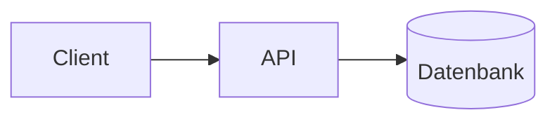

# Skill: architektur-skizze

## Wann anwenden
Beim Entwurf oder der Beschreibung von Systemstruktur: Komponenten, Module,
Schnittstellen, Datenflüsse, Deployment. Ergänzt `entscheidung-dokumentieren`
(die das *Warum* der Wahl festhält).

## Schritte
1. Vorlage `vault/90_Templates/Architektur.md` kopieren nach
   `vault/20_Architektur/`.
2. Inhalte erfassen:
   - **Kontext & Ziel:** Was soll die Architektur leisten?
   - **Komponenten:** Bausteine und ihre Verantwortlichkeiten.
   - **Schnittstellen & Datenfluss:** Wer spricht mit wem, womit.
   - **Diagramm:** wenn sinnvoll als [Mermaid](https://mermaid.js.org/) im
     Code-Block (in Obsidian darstellbar, in Git diff-bar).
   - **Offene Fragen / Risiken.**
3. Verlinke zugehörige Entscheidungen (`[[ADR-…]]`) und Umsetzungsnotizen.
4. Im MOC `vault/00_Start/Start.md` unter „Architektur" eintragen.

## Tipp
Mermaid bleibt textbasiert und damit versionierbar – bevorzuge es gegenüber
eingebetteten Bildern, solange es ausreicht.

````

````
