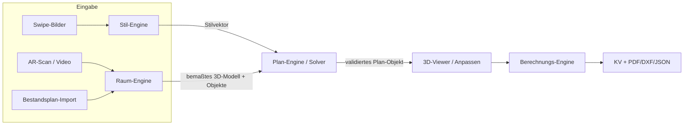

# Lokaler MVP-POC – Architektur v0

> Erster Architekturentwurf für den lokalen End-to-End-POC
> ([[ADR-0001-lokaler-mvp-poc-opensource]]). Bausteine & Begründung:
> [[Tech-Bausteine-Open-Source]]. **Offen:** Lauf-Plattform des POC (siehe unten)
> – wird als nächste Entscheidung getroffen.

## Kontext & Ziel
Alle vier Modulfunktionen lokal und durchgängig demonstrieren, ohne produktive
Cloud. Leitkriterium: **Performance** (echtzeitnah, leichtgewichtig).

## Komponenten
| Komponente | Verantwortung | Bausteine |
|---|---|---|
| **Aufnahme** | Raum erfassen (oder Plan-Import) | ARKit/ARCore bzw. Video → lokal |
| **Raum-Engine** | bemaßtes 3D-Modell + Objektlabels | AR-Pose, Layout-Schätzung, Depth Anything V2, YOLO/SAM2 |
| **Stil-Engine** | Stilvektor aus Swipes | Bild-Katalog (JSON) + Vektor-Logik |
| **Plan-Engine** | normkonformer Vorschlag | Solver (Constraints + Score), Möbel-Katalog |
| **Berechnungs-Engine** | Mengen, KV, Export | Preistabelle (BKP), PDF/DXF/JSON |
| **Viewer/UI** | Swipe, 3D-Ansicht, Anpassen, KV | three.js / react-three-fiber |
| **Lokale Daten** | Kataloge & Preise | JSON/Files statt DB |

## Datenfluss (Modulkette)

## Schnitt-Prinzip (zukunftssicher)
Klare Modulgrenzen mit definierten Datenübergaben (Stilvektor, 3D-Modell,
Plan-Objekt) – so ist der lokale POC später ohne Totalumbau in eine Cloud-/
Mobile-Variante überführbar ([[ADR-0001-lokaler-mvp-poc-opensource]]).

## Lauf-Plattform des POC (entschieden)
**Web/Desktop-Kern + Phone-AR-Spike** – siehe
[[ADR-0002-poc-plattform-und-stack]]. Stack: React + Vite + three.js
(react-three-fiber) im Frontend, lokaler **Python/FastAPI**-Dienst für die
Engines, lokale JSON-Daten; separater Expo/WebXR-Spike für den Live-Scan.

## Offene Fragen / Risiken
- Genauigkeit der Raumvermessung ohne LiDAR (Spike nötig).
- Performance der ML-Bausteine lokal (Modellgrössen wählen).

## Verknüpfungen
- [[ADR-0001-lokaler-mvp-poc-opensource]] · [[Tech-Bausteine-Open-Source]]
- [[Anforderungen-Software]] · [[Modulablauf-v1]]
