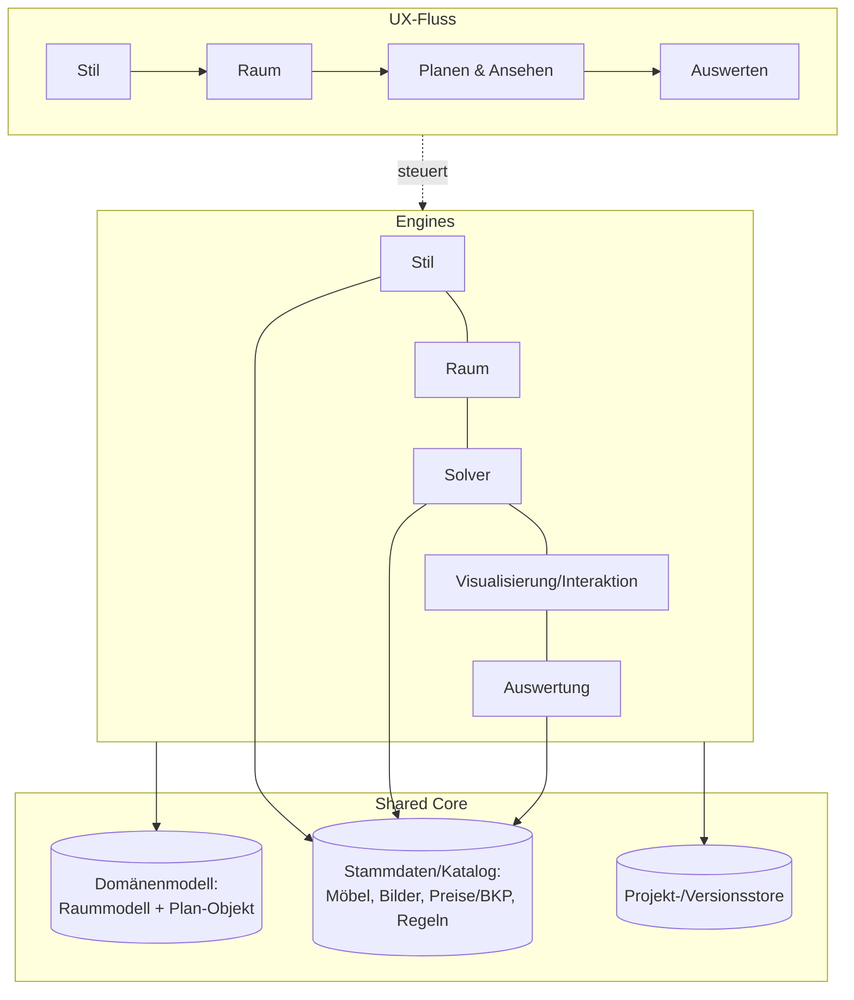

# Modul- & Architektur-Struktur – Analyse

> Hinterfragt die „4-Module"-Annahme aus dem Pitch (siehe
> [[Offene-Grundsatzfragen]] A). Ziel: eine technisch saubere Zerlegung finden.
> Bezug: [[Modulablauf-v1]], [[Lokaler-MVP-POC-Architektur-v0]].

## Kernunterscheidung: UX-Fluss ≠ technische Fähigkeiten
- **UX-Fluss** (Pitch): Stil swipen → Raum erfassen → planen/ansehen →
  auswerten. Das sind **Journey-Schritte** für Nutzer & Marketing.
- **Technische Fähigkeiten**: was das System wirklich können/vorhalten muss –
  unabhängig von der Reihenfolge. Beides muss **nicht 1:1** dasselbe sein.

## Die tatsächlich nötigen Fähigkeiten
1. **Stil-Engine** – Swipes → Stilvektor.
2. **Raum-Engine** – Scan/Video **oder** Plan-Import → bemaßtes, segmentiertes
   Raummodell.
3. **Planungs-Solver** – Raummodell + Stil + Katalog + Regeln → Plan-Objekt.
4. **Visualisierung & Interaktion** – 3D-Viewer, Bearbeiten, AR, **Kollaboration**.
5. **Auswertungs-Engine** – Plan-Objekt → Mengen, KV (BKP), Gewerke, Zeitplan,
   Dokumente (PDF/DXF/JSON), Handwerker-Matching.

**Querschnitt (im Pitch versteckt, aber real):**
- **Stammdaten/Katalog-Layer** – Möbel (3D/Masse/Tags/Preis), Bild-Katalog,
  Preistabelle (BKP), **Regeln/Normen** (harte Constraints), Handwerkerdaten.
  → Im Pitch eine eigene „Datengrundlagen"-Slide, aber **kein** Modul.
- **Projekt-/Versionshaltung** – speichern, Versionen, teilen (Pitch nennt
  „speichern/teilen", listet aber kein Modul dafür).

➡️ Es sind also eher **5 Engines + 2 Querschnitts-Layer**, nicht „4 Module".

## Optionen für die Zerlegung

### Option 1 – Pitch-treu (4 Module = 4 technische Module)
- **+** simpel, deckt sich mit Pitch/Marketing, leicht zu kommunizieren.
- **−** versteckt Stammdaten & Projekthaltung; bündelt Visualisierung in die
  Planung (andere Sorge); fettes „Planungs"-Modul; UX-Reihenfolge in der
  Architektur zementiert (kein iteratives Scan ↔ Plan).

### Option 2 – Rein fähigkeitsorientiert (entkoppelt von UX)
5 Engines + 2 Layer, eine dünne Orchestrierung bildet daraus die Journey.
- **+** saubere Trennung; jede Engine einzeln testbar/austauschbar (passt zu
  OSS-Bausteinen & „alles ist Hypothese"); Visualisierung entkoppelt;
  Datenschicht explizit; iteratives Scan ↔ Plan möglich.
- **−** mehr Teile als „4"; Mapping UX↔Engines nötig; etwas mehr Vorab-Design.

### Option 3 – Hybrid: Pipeline + Shared Core  ✅ (Empfehlung)
Behalte die verständliche UX-Pipeline, ergänze aber explizit einen **Shared
Core**: zentrales **Domänenmodell** (Raummodell + Plan-Objekt als Rückgrat),
**Stammdaten/Katalog-Layer**, **Projektstore** – und ziehe **Visualisierung**
als eigene Schicht heraus.
- **+** kommuniziert sich weiter als „4-Schritte-Reise", schliesst aber die zwei
  echten Lücken; das **Plan-Objekt/Raummodell als zentrales Artefakt**
  de-riskt genau die Datenübergaben (das eigentliche Integrationsrisiko); passt
  zum lokalen Engine-Schnitt ([[ADR-0002-poc-plattform-und-stack]]).
- **−** weiterhin grob linear (Schleifen möglich, aber nicht das Leitbild).

## Empfehlung
**Option 3** für den POC, gedacht mit der **Fähigkeits-Brille** von Option 2:
„Module" werden zum Implementierungsdetail, das **Domänenmodell** (Raummodell &
Plan-Objekt) ist der stabile Kern. Die Anzahl Module ist damit bewusst **nicht
auf 4 fixiert**.

## Offene Entscheidung
Zerlegung wählen → als **ADR-0004** festhalten. Danach: Datenschemata des
Domänenmodells skizzieren (das ist der eigentliche Hebel für die Integration).

## Verknüpfungen
- [[Offene-Grundsatzfragen]] · [[Modulablauf-v1]]
- [[Lokaler-MVP-POC-Architektur-v0]] · [[ADR-0002-poc-plattform-und-stack]]
