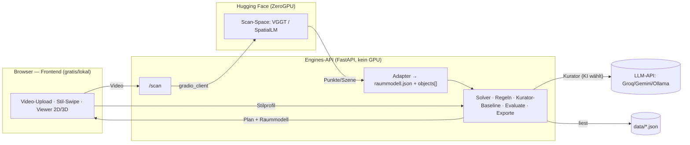

# POC-Demo-Architektur (HF-basiert)

## Kontext & Ziel
Der POC ist **reine Demo, Einzelnutzer** (Bryan) – also **leicht im Web** zeigbar,
und die **GPU-schwere ML** läuft **auf Hugging Face**, angesprochen **per API**.
Begrenzte/gratis GPU ist bei einem Nutzer unkritisch. Trennung POC↔Produkt:
[[ADR-0011-poc-externe-cloud-apis]] (Produkt später on-device/self-hosted).

## Komponenten – wo läuft was
| Komponente | Läuft wo | Verantwortung | GPU? |
|---|---|---|---|
| **Frontend** (`apps/web`, gebaut = statisch) | **im selben HF Space** (von den Engines als `dist/` ausgeliefert) | UI, **Datei-Upload (Video + `poses.json`** aus fertiger AR-App), Stil-Swipe, Viewer 2D/3D, Live-Ampel | nein |
| **Engines-API** (FastAPI) | **HF Space (gratis, CPU)** – ein Deploy zusammen mit dem Frontend | **Orchestrator** + Solver · Regeln · Kurator-Anbindung · Evaluate · Exporte · **Scan→Raummodell-Adapter** · Weiterleitung an den Colab-Worker | nein (pure Python) |
| **Scan-Worker** (`services/scan-worker`) | **Colab (gratis T4)**, manuell angeworfen | known-pose Fusion → Cleaning → z-up → Skalierung → **SpatialLM** | ja (Colab) |
| **LLM-Kurator** | **Groq (Qwen3-32B)** via `FP_KURATOR_URL` | „KI wählt" (sonst Baseline) | extern |
| **Stammdaten** | `data/*.json` im Repo | Katalog · Regeln · Sample-Räume | nein |

→ **Nur die ML läuft auf HF.** Alles andere (UI, Orchestrierung, normkonformer
Solver, Regeln, Auswertung, Exporte, Daten) ist **leicht & GPU-frei**.

## Schnittstellen & Datenfluss

Keys/Token bleiben **server-seitig** (Engines); das Frontend spricht nie direkt
mit HF/LLM. Über die Cloud nur **Sample-/Testräume** ([[ADR-0009-privacy-raumdaten]]).

## HF-Module zuerst separat testen (vor der Integration)
Geht einfach – ein Gradio-Space bietet UI **und** API:
1. **Space-UI:** R1-Video hochladen, Output (Punkte/Wände/Boxen) direkt im
   Browser ansehen → erster Sanity-Check, **null Integration**.
2. **API-Test:** 5-Zeilen `gradio_client`-Skript → Output-Form prüfen (passt sie
   zum Adapter?).
3. **Genauigkeit:** Output gegen R1-Ground-Truth mit `eval_metrics` messen
   ([[M2-M7-Scan-Pipeline-Fahrplan]]) → Go/Anpassen/Pivot.
4. **Erst dann** in Engines `/scan` verdrahten.

## Umsetzbarkeit (Re-Check, Einzelnutzer-Demo)
- **Infrastruktur: ✅ einfach.** ZeroGPU-Quota (PRO ~40 Min GPU/Tag) reicht für
  Demo-Runs eines Nutzers locker; Engines brauchen **kein** GPU und laufen überall.
- **Eigentliches Risiko = Genauigkeit** des Auto-Scans (weisse Wände, Massstab) –
  **nicht** die Infra. Deshalb **erst messen (Spike), dann Demo-Zentrum.**
- **VGGT vs. SpatialLM:** VGGT hat ein **fertiges Space** (Punkte/Posen → wir
  bauen Layout-Fit + Detektion); SpatialLM liefert **Wände + Objekt-Boxen direkt**
  (weniger eigener Adapter), braucht aber ein **eigenes Space** und hat einen
  **NC-Encoder** (POC ok, Produkt nicht).

## Deployment: EIN Code-Repo, EIN Space, EIN Worker (Festlegung 2026-07)
Ziel: **geteilter Web-Link** – und **`fp_app` bleibt das einzige Code-Repo**;
HF und Colab sind nur **Konsumenten** davon:

| Konsument | Sync-Mechanik | Konfig |
|---|---|---|
| **HF Space** (Frontend + Engines, CPU) | HF Spaces sind selbst Git-Repos → **GitHub-Action** pusht bei jedem `main`-Push automatisch in den Space (`deploy-space.yml`, einmalig `HF_TOKEN` als GitHub-Secret) | Start `uvicorn fp_engines.api:app`; FastAPI serviert `dist/`; Secrets `FP_KURATOR_URL/_MODEL/_API_KEY` (Groq) im Space |
| **Colab** (scan-worker, T4) | Notebook **klont dasselbe Repo** (privat → einmalig GitHub-PAT in Colab-Secrets) und startet `services/scan-worker` als Gradio-App (share-URL → Zeiger) | fertige Modelle (SpatialLM, Depth Anything V2 Small) werden **beim Session-Start von HF geladen – NIE ins Git** (Repo-Regel + NC-Lizenz) |

**Kleine Code-Anpassungen:** `dist/`-Mount in FastAPI (StaticFiles, wie `/bilder`)
· `deploy-space.yml` · `/health` als Healthcheck (existiert). **Kein CORS, kein
`VITE_API_URL` nötig** – eine Origin. **Scan ist langlaufend** → Job/Polling oder
grosszügiges Timeout + kurze Videos.

**Phasen: (1) jetzt** – bestehende Planungs-Demo als Space deployen → sofort
geteilter Link (Sample-Räume → Plan → Viewer → KV; optional LLM-Kurator),
**kein ML nötig**. **(2)** Video-Scan dazu (scan-worker + `/scan` + Upload-UI).

> Die frühere Zwei-Deploy-Variante (Frontend Vercel/Cloudflare + Engines
> Render/Fly, CORS + `VITE_API_URL`) ist damit **abgelöst** – mehr Konfig, zwei
> URLs, CORS-Pflege, ohne Vorteil für den Einzelnutzer-POC.

## Festlegung 2026-07 (Bryan): statisches HF-Space-Frontend + Colab-GPU-Worker
Für den **Gratis-Demo-POC** (reine Demo, kein Dauerbetrieb) konkretisiert Bryan
die Topologie – **präzisiert** die obige (Vercel/Render + HF-ZeroGPU-)Variante:

| Teil | Läuft wo | Warum |
|---|---|---|
| **Frontend + Engines (Solver · Kurator · Viewer · Adapter)** | **EIN HF Space (gratis, CPU)** – FastAPI serviert das gebaute Frontend (`dist/`) + die API unter **einer Origin** | CPU-leicht, dauerhaft gratis, **feste URL** fürs Pitchen, **kein CORS** |
| **GPU-Scan (Fusion + SpatialLM)** | **Colab (gratis T4)** – vor der Demo **manuell anwerfen** | GPU nötig; für Einzel-Demo unkritisch, da man ohnehin dabei ist |

- **Frontend-Mechanik (präzisiert 2026-07):** Der gebaute React/Vite-Viewer
  **ist** statisches HTML/JS/CSS (voller CI-Spielraum) – es braucht **kein neues
  Frontend**. Da die Engines **bereits FastAPI** sind und das Frontend die API
  **relativ** (`/api/*`, kein CORS im Code) aufruft, serviert FastAPI `dist/`
  direkt (StaticFiles, wie heute schon `/bilder`). `gradio.Server` (eigene
  `index.html` via `@app.get("/")`, Gradio-Endpoints als `@app.api()`) ist die
  gleichwertige Alternative – Implementierungsdetail ohne Architekturfolge.
  **Gradio ist nur auf der Colab-Seite Pflicht** (share-URL = gratis Tunnel =
  der „Zeiger").
- **Verbindung («Zeiger»):** Colab startet den Worker mit Gradio-share-URL.
  **v0 (umgesetzt): URL wird MANUELL als Space-Variable `FP_SCAN_WORKER_URL`
  gesetzt** – null Zusatz-Infrastruktur, für die Einzel-Demo genügt das (man
  wirft Colab ohnehin von Hand an). Automatischer Zeiger (Drive-Datei /
  GitHub-Gist, Space liest selbst) = späterer Komfort-Schritt. Übergabe intern
  immer über **`raummodell.json`** – der spätere Umzug bleibt ein **Umstecken**.
- **Warum nicht reines HF Spaces:** Gratis-Spaces sind **CPU-only**; GPU-Spaces
  kosten (Stundentarif). Für einen nie-aktiv-betriebenen Demo-POC ist „gratis +
  manuell anwerfen" (Colab) besser als „bezahlt + bequem".
- **GPU-Worker (entschieden 2026-07): Colab bleibt** – gratis, ausreichend für die
  Einzel-Demo. **HF ZeroGPU vorerst NICHT verfolgt** (wäre der Komfort-Upgrade:
  „draufgehen → startet", nur echte Nutzungszeit). Bei Bedarf später: Umzug auf
  GPU-Space, Colab fällt weg – kleiner Schritt, weil dieselbe Gradio-App +
  dasselbe `raummodell.json` im Zentrum bleiben.
  - **Nachtrag (Bryans Frage 2026-07-13, gratis ZeroGPU ~5 Min/Tag):**
    grundsätzlich machbar, aber der Haken ist **nicht die Quota, sondern der
    flash-attn/Sonata-Build** + das Call-Zeitlimit; Lizenz bleibt NC. Detail-
    Analyse: [[Scan-GPU-Gratis-ZeroGPU-vs-Colab]].
- **Colab-Stolperfallen:** TorchSparse-Compile (bis 30 min/Session) → **Wheel
  einmalig nach Drive** sichern, dann nur installieren (Start <2 min); **eine**
  Setup-Zelle (installieren + Drive mounten); Videos **über Drive** laden, nie
  direkt hochladen.
- **Demo-Regel: Scan vorberechnen** – live nur Upload zeigen, Rest auf fertigem
  `raummodell.json` (Sekunden). Zickt WLAN/Colab, steht die Demo trotzdem.
  Laufzeit-Hebel: [[Scan-Laufzeit-Budget-und-Beschleunigung]].

## Offene Fragen / Risiken
- **Scan-Modell:** VGGT (ready, mehr Adapter) **oder** SpatialLM (mehr Output, NC,
  eigenes Space)? → im Spike beide gegen R1 vergleichen.
- **Engines-Hosting** für den geteilten Link: lokal / Gratis-PaaS / HF-Docker-Space?
- **Massstab/Wandgenauigkeit** auf realem Video (Kernrisiko, Spike entscheidet).
- ZeroGPU-Cold-Start beim ersten Call (Demo: kurz warten, ok).

## Verknüpfungen
- Entscheidungen: [[ADR-0011-poc-externe-cloud-apis]] · [[ADR-0003-raumerfassung-ansatz]] · [[ADR-0009-privacy-raumdaten]]
- Umsetzung: [[M2-M7-Scan-Pipeline-Fahrplan]] · [[Raumerfassung-Technologie-Optionen]] · [[Engineering-Grundlagen-POC]] · [[Lokaler-MVP-POC-Architektur-v0]]
