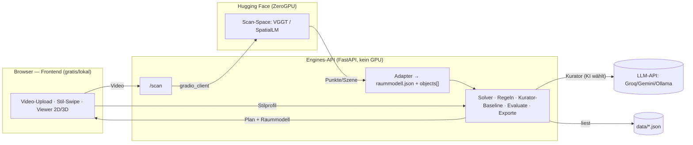

# POC-Demo-Architektur (HF-basiert)

## Kontext & Ziel
Der POC ist **reine Demo, Einzelnutzer** (Bryan) – also **leicht im Web** zeigbar,
und die **GPU-schwere ML** läuft **auf Hugging Face**, angesprochen **per API**.
Begrenzte/gratis GPU ist bei einem Nutzer unkritisch. Trennung POC↔Produkt:
[[ADR-0011-poc-externe-cloud-apis]] (Produkt später on-device/self-hosted).

## Komponenten – wo läuft was
| Komponente | Läuft wo | Verantwortung | GPU? |
|---|---|---|---|
| **Frontend** (`apps/web`) | Browser (Vercel/Netlify gratis **oder** lokal) | UI, **Video-Upload**, Stil-Swipe, Viewer 2D/3D, Live-Ampel | nein |
| **Engines-API** (FastAPI) | lokal **oder** Gratis-PaaS (Render/Fly) **oder** HF-Docker-Space | **Orchestrator** + Solver · Regeln · Kurator-Baseline · Evaluate · Exporte · **Scan→Raummodell-Adapter** | nein (pure Python) |
| **Scan-Space** | **HF (ZeroGPU)** | Video → Punktwolke/struktur. Szene (**VGGT** oder **SpatialLM**) | ja (HF) |
| **Detektion** (optional) | HF Serverless **oder** Space | Objekte erkennen/segmentieren (Grounding DINO + SAM2) | ja (HF) |
| **LLM-Kurator** | Groq/Gemini/**Ollama** via `FP_KURATOR_URL` | „KI wählt" (sonst Baseline) | extern |
| **Stammdaten** | `data/*.json` im Repo | Katalog · Regeln · Sample-Räume | nein |

→ **Nur die ML läuft auf HF.** Alles andere (UI, Orchestrierung, normkonformer
Solver, Regeln, Auswertung, Exporte, Daten) ist **leicht & GPU-frei**.

## Schnittstellen & Datenfluss

Keys/Token bleiben **server-seitig** (Engines); das Frontend spricht nie direkt
mit HF/LLM. Über die Cloud nur **Sample-/Testräume** ([[ADR-0009-privacy-raumdaten]]).

## HF-Module zuerst separat testen (vor der Integration)
Geht einfach – ein Gradio-Space bietet UI **und** API:
1. **Space-UI:** R1-Video hochladen, Output (Punkte/Wände/Boxen) direkt im
   Browser ansehen → erster Sanity-Check, **null Integration**.
2. **API-Test:** 5-Zeilen `gradio_client`-Skript → Output-Form prüfen (passt sie
   zum Adapter?).
3. **Genauigkeit:** Output gegen R1-Ground-Truth mit `eval_metrics` messen
   ([[M2-M7-Scan-Pipeline-Fahrplan]]) → Go/Anpassen/Pivot.
4. **Erst dann** in Engines `/scan` verdrahten.

## Umsetzbarkeit (Re-Check, Einzelnutzer-Demo)
- **Infrastruktur: ✅ einfach.** ZeroGPU-Quota (PRO ~40 Min GPU/Tag) reicht für
  Demo-Runs eines Nutzers locker; Engines brauchen **kein** GPU und laufen überall.
- **Eigentliches Risiko = Genauigkeit** des Auto-Scans (weisse Wände, Massstab) –
  **nicht** die Infra. Deshalb **erst messen (Spike), dann Demo-Zentrum.**
- **VGGT vs. SpatialLM:** VGGT hat ein **fertiges Space** (Punkte/Posen → wir
  bauen Layout-Fit + Detektion); SpatialLM liefert **Wände + Objekt-Boxen direkt**
  (weniger eigener Adapter), braucht aber ein **eigenes Space** und hat einen
  **NC-Encoder** (POC ok, Produkt nicht).

## Deployment (Cloud-Hosting, gratis – nichts lokal)
Ziel: **geteilter Web-Link**. Zwei Deploys aus dem Monorepo:

| Teil | Dienst (gratis) | Konfig |
|---|---|---|
| **Frontend** (`apps/web`) | **Vercel** / Cloudflare Pages | Root `apps/web`, Build `pnpm build` → `dist`; Env `VITE_API_URL`=Engines-URL; Auto-Deploy bei Push |
| **Engines** (`services/engines`) | **Render** (Free Web Service) | Start `uvicorn fp_engines.api:app --host 0.0.0.0 --port $PORT` (Dockerfile mit uv ODER Render-Python); Secrets `HF_TOKEN`, `FP_KURATOR_URL/_MODEL/_API_KEY`; **CORS** für die Vercel-Domain |
| **ML** | **HF Spaces (ZeroGPU)** | Engines callt per `gradio_client` (HF_TOKEN) |
| **LLM** | Groq/Gemini via `FP_KURATOR_URL` | optional |

**Kleine Code-Anpassungen:** CORS-Middleware in FastAPI · Frontend-API-Basis
konfigurierbar (`VITE_API_URL` statt fixem Dev-Proxy) · `render.yaml`-Blueprint ·
`/health` als Healthcheck (existiert). **Scan ist langlaufend** → Job/Polling ODER
grosszügiges Timeout + kurze Videos (Render-Free schläft nach ~15 Min →
Cold-Start beim ersten Call, für Einzelnutzer ok).

**Phasen: (1) jetzt** – bestehende Planungs-Demo deployen (Vercel + Render) →
sofort geteilter Link (Sample-Räume → Plan → Viewer → KV; optional LLM-Kurator),
**kein ML nötig**. **(2)** Video-Scan dazu (HF-Space + `/scan` + Upload-UI).

## Offene Fragen / Risiken
- **Scan-Modell:** VGGT (ready, mehr Adapter) **oder** SpatialLM (mehr Output, NC,
  eigenes Space)? → im Spike beide gegen R1 vergleichen.
- **Engines-Hosting** für den geteilten Link: lokal / Gratis-PaaS / HF-Docker-Space?
- **Massstab/Wandgenauigkeit** auf realem Video (Kernrisiko, Spike entscheidet).
- ZeroGPU-Cold-Start beim ersten Call (Demo: kurz warten, ok).

## Verknüpfungen
- Entscheidungen: [[ADR-0011-poc-externe-cloud-apis]] · [[ADR-0003-raumerfassung-ansatz]] · [[ADR-0009-privacy-raumdaten]]
- Umsetzung: [[M2-M7-Scan-Pipeline-Fahrplan]] · [[Raumerfassung-Technologie-Optionen]] · [[Engineering-Grundlagen-POC]] · [[Lokaler-MVP-POC-Architektur-v0]]
