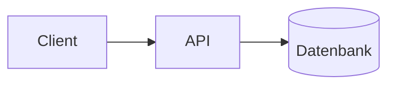

# {{titel}}

## Kontext & Ziel
_Was soll diese Architektur leisten? Welches Problem löst sie?_

## Komponenten
| Komponente | Verantwortung |
|---|---|
|  |  |

## Schnittstellen & Datenfluss
_Wer kommuniziert mit wem, über welche Schnittstelle, mit welchen Daten?_

## Offene Fragen / Risiken
- 

## Verknüpfungen
- Zugehörige Entscheidungen: [[ ]]
- Umsetzung: [[ ]]
